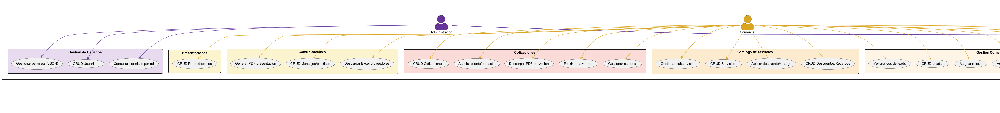
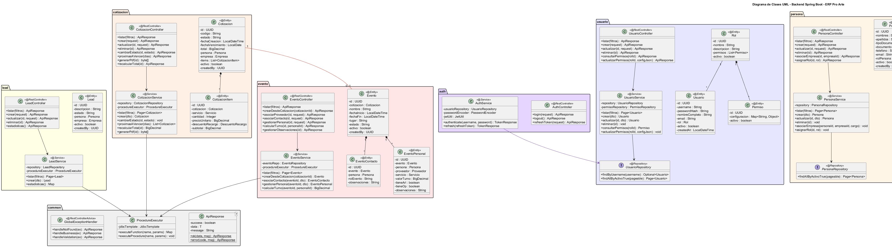
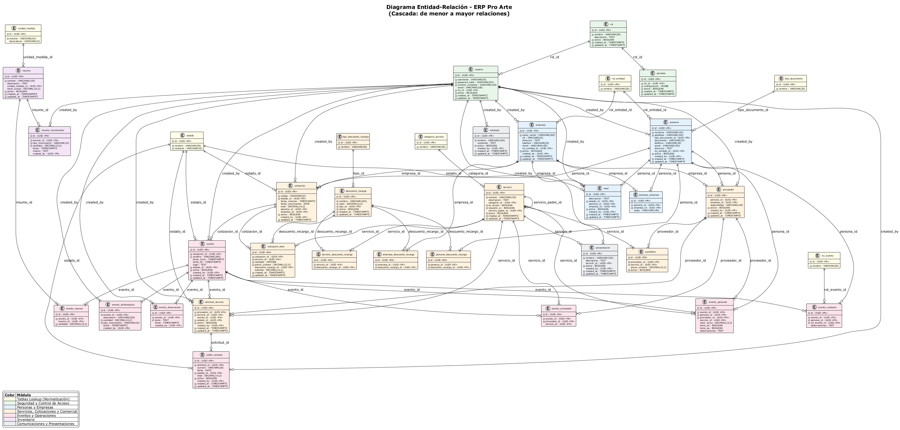

# Design Document

## Overview

Diseno tecnico del ERP Pro Arte. Sistema web de tres capas: Angular (frontend), Spring Boot (API REST), PostgreSQL (datos + logica de negocio). Toda la logica de negocio se implementa en la base de datos mediante functions, triggers y procedures. El backend solo expone endpoints CRUD y ejecuta llamados a la DB en formato JSON.

## Architecture

### Arquitectura General (Three-Tier)

```
[Angular SPA] <--JSON/HTTP--> [Spring Boot API REST] <--JDBC--> [PostgreSQL]
     |                              |                              |
  Presentacion              Capa de Transporte            Datos + Logica
  - Componentes             - Controllers                - Tablas
  - Services                - DTOs (Records)             - Functions
  - Guards                  - Repositories               - Triggers
  - Interceptors            - Security (JWT)             - Procedures
```

### Principios de Diseno

1. Logica en DB: Functions, triggers y procedures en PostgreSQL manejan calculos y reglas de negocio
2. Backend delgado: Spring Boot solo transporta datos (CRUD) y ejecuta procedures via JSON
3. Frontend reactivo: Angular con signals, standalone components y lazy loading
4. Seguridad en DB: Permisos gestionados en PostgreSQL, expuestos via API
5. Eliminacion logica: Todos los registros usan campo activo (boolean) en vez de DELETE fisico

## Components and Interfaces

### Diagrama de Casos de Uso con Actores



### API REST - Endpoints por Modulo

| Modulo | Endpoint Base | Operaciones |
|--------|--------------|-------------|
| Auth | /api/v1/auth | login, logout, refresh-token |
| Usuarios | /api/v1/usuarios | CRUD + /roles/{id}/permisos (GET, PUT del JSON) |
| Leads | /api/v1/leads | CRUD + /estadisticas |
| Personas | /api/v1/personas | CRUD + /asociar-empresa + /asignar-rol |
| Empresas | /api/v1/empresas | CRUD + /asignar-rol |
| Proveedores | /api/v1/proveedores | CRUD + /portafolio + /solicitudes |
| Servicios | /api/v1/servicios | CRUD + /subservicios + /categorizar |
| Descuentos/Recargos | /api/v1/descuentos-recargos | CRUD + /aplicar (a servicio, persona o empresa) |
| Cotizaciones | /api/v1/cotizaciones | CRUD + /estados + /vencimientos + /pdf |
| Eventos | /api/v1/eventos | CRUD + /proveedores + /servicios + /personas + /observaciones |
| Personal | /api/v1/eventos/{id}/personal | CRUD + /execute/calcular_turno |
| Ordenes | /api/v1/ordenes-compra | CRUD + /descargar-excel |
| Mensajes | /api/v1/mensajes | CRUD |
| Presentaciones | /api/v1/presentaciones | CRUD + /pdf |
| Inventario | /api/v1/inventario | consultar + /ingresos + /retiros |
| Alimentacion | /api/v1/eventos/{id}/alimentacion | consultar + /ingresos + /retiros |
| Catalogos | /api/v1/catalogos/{tipo} | GET list + POST create + PUT update + DELETE (tipos: tipo-documento, rol-entidad, estado, categoria-servicio, unidad-medida, rol-evento) |

### Formato JSON Request/Response

```json
// Response exitoso
{ "success": true, "data": { }, "message": "Operacion realizada correctamente" }

// Response de error
{ "success": false, "error": { "code": "ERR_VALIDATION", "message": "Mensaje en espanol" } }

// Request para ejecutar procedure/function
// POST /api/v1/{modulo}/execute/{function_name}
{ "params": { "cotizacion_id": "uuid-here" } }
```

### Modelo de Permisos (JSON en PostgreSQL)

La tabla `permiso` almacena un campo JSONB `configuracion` que define los accesos granulares de cada rol. La validacion se hace a nivel de aplicacion (Spring Security + Angular guards), NO con GRANT/REVOKE nativos de PostgreSQL (ya que la app usa un unico usuario de conexion via pool HikariCP).

Justificacion tecnica (segun mejores practicas documentadas):
- PostgreSQL GRANT/REVOKE opera sobre roles de DB, no usuarios de aplicacion
- Spring Boot usa connection pooling (HikariCP) con UN solo usuario de DB
- Crear un rol PostgreSQL por usuario de app rompe el pooling y no escala
- La validacion correcta es: JSONB en DB + verificacion en backend por cada request
- El frontend consulta los permisos del usuario logueado para mostrar/ocultar UI

```json
// Ejemplo: permisos del rol "Comercial"
{
  "tablas": {
    "lead": { "ver_listado": true, "ver_detalle": true, "crear": true, "editar": true, "eliminar": true },
    "persona": { "ver_listado": true, "ver_detalle": true, "crear": true, "editar": true, "eliminar": false },
    "empresa": { "ver_listado": true, "ver_detalle": true, "crear": true, "editar": true, "eliminar": false },
    "cotizacion": { "ver_listado": true, "ver_detalle": true, "crear": true, "editar": true, "eliminar": false },
    "evento": { "ver_listado": true, "ver_detalle": true, "crear": false, "editar": false, "eliminar": false },
    "usuario": { "ver_listado": false, "ver_detalle": false, "crear": false, "editar": false, "eliminar": false }
  },
  "contexto": {
    "cotizacion": ["persona", "empresa", "cotizacion_item", "servicio"],
    "lead": ["persona", "empresa"],
    "persona": ["empresa", "lead", "cotizacion"]
  }
}
```

Reglas del modelo:
- `tablas`: define por cada tabla si el usuario puede ver listado, ver detalle, crear, editar o eliminar
- `contexto`: define que tablas relacionadas (FK) se muestran al ver el detalle de un registro
- Si una tabla no aparece en `tablas`, el usuario NO tiene acceso (deny by default)
- Si una tabla no aparece en `contexto`, sus registros relacionados NO se muestran en la vista detalle
- Spring Security valida permisos en CADA request comparando la accion con el JSON del rol del usuario
- El acceso directo a PostgreSQL (CLI, pgAdmin) se gestiona con roles nativos asignados manualmente por el administrador (fuera del sistema web)

### Patron de Vista Detalle con Contexto

Cuando el usuario hace clic en el icono de ojo (ver) de un registro:

```
┌─────────────────────────────────────────────────────────────┐
│  Detalle: Cotizacion COT-2024-001                    [Cerrar]│
├─────────────────────────────────────────────────────────────┤
│                                                             │
│  Codigo: COT-2024-001    Estado: Aprobada                   │
│  Fecha: 2024-03-15       Vencimiento: 2024-04-15            │
│  Total: $15,500,000      Cliente: Empresa XYZ               │
│                                                             │
├─────────────────────────────────────────────────────────────┤
│  CONTEXTO (tablas relacionadas segun permisos)              │
│                                                             │
│  ┌─ Items de Cotizacion ──────────────────────────────────┐ │
│  │ Servicio        | Cantidad | Precio    | Subtotal      │ │
│  │ Sonido          | 1        | 5,000,000 | 5,000,000     │ │
│  │ Iluminacion     | 2        | 3,000,000 | 6,000,000     │ │
│  └────────────────────────────────────────────────────────┘ │
│                                                             │
│  ┌─ Persona (Cliente) ───────────────────────────────────┐  │
│  │ Juan Perez | CC 12345 | juan@email.com                │  │
│  └────────────────────────────────────────────────────────┘ │
│                                                             │
│  ┌─ Evento generado ────────────────────────────────────┐   │
│  │ (Solo visible si usuario tiene permiso "evento")     │   │
│  │ EVT-001 | 2024-04-20 | Club El Country              │   │
│  └────────────────────────────────────────────────────────┘ │
└─────────────────────────────────────────────────────────────┘
```

### Botones de Accion en Tablas (Listados)

Cada fila en un listado muestra 3 botones de accion (segun permisos):

| Icono | Accion | Permiso requerido | Comportamiento |
|-------|--------|-------------------|----------------|
| Ojo | Ver detalle | `ver_detalle` | Abre vista detalle con contexto |
| Lapiz | Editar | `editar` | Abre formulario de edicion |
| X | Eliminar | `eliminar` | Muestra dialogo de confirmacion, ejecuta soft-delete |

Si el usuario no tiene el permiso correspondiente, el boton NO se renderiza.

### Campos Autocalculados

Algunos campos se recalculan cada vez que se carga la pagina o tabla (no se editan manualmente):

| Tabla | Campo | Calculo |
|-------|-------|---------|
| cotizacion | total | SUM(cotizacion_item.subtotal) via fn_recalcular_total_cotizacion |
| cotizacion_item | subtotal | cantidad * precio_unitario +/- descuento_recargo |
| insumo | stock_actual | SUM(ingresos) - SUM(retiros) via trigger |
| evento_personal | valor_turno | Calculado via fn_calcular_valor_turno |

Estos campos se almacenan en la tabla (denormalizados para performance) pero se recalculan al cargar la vista.


### Frontend (Angular) - Estructura de Componentes

```
src/app/
├── core/                          # Servicios singleton, guards, interceptors
│   ├── services/ (auth, theme, error-message)
│   ├── guards/ (auth.guard, permission.guard)
│   └── interceptors/ (jwt, error)
├── shared/                        # Componentes reutilizables
│   ├── components/ (data-table, confirm-dialog, animated-button, search-filter)
│   ├── animations/ (button.animations.ts)
│   └── pipes/
├── features/                      # Un directorio por modulo (lazy loaded)
│   ├── auth/login/
│   ├── dashboard/
│   ├── usuarios/    (list + form + service + models)
│   ├── leads/       (list + form + chart + service + models)
│   ├── personas/    (list + form + service + models)
│   ├── empresas/    (list + form + service + models)
│   ├── proveedores/ (list + form + portafolio + solicitudes + service)
│   ├── servicios/   (list + form + subservicios + service)
│   ├── cotizaciones/(list + form + estados + pdf + service)
│   ├── eventos/     (list + detail + personas + observaciones + service)
│   ├── ordenes-compra/(list + form + excel + service)
│   ├── mensajes/    (list + form + service)
│   ├── presentaciones/(list + form + pdf + service)
│   ├── inventario/  (stock + ingresos + retiros + service)
│   └── alimentacion/(list + ingresos + retiros + service)
└── app.routes.ts                  # Rutas con lazy loading
```

### Backend (Spring Boot) - Estructura de Paquetes



## Data Models

### Diagrama ERD (Entidad-Relacion)




### Tablas Principales (Resumen)

#### Tablas Lookup (Normalizacion V10)

| Tabla | Descripcion | Usada por |
|-------|-------------|-----------|
| tipo_documento | Tipos de documento (CC, CE, NIT, PA, TI, RC) | persona.tipo_documento_id |
| rol_entidad | Roles de persona/empresa (contacto, cliente, proveedor, aliado, artista) | persona.rol_entidad_id, empresa.rol_entidad_id |
| estado | Estados con contexto (lead, cotizacion, evento, solicitud, orden) | lead.estado_id, cotizacion.estado_id, evento.estado_id, solicitud_servicio.estado_id, orden_compra.estado_id |
| categoria_servicio | Categorias de servicio (Propio, Tercero) | servicio.categoria_id |
| unidad_medida | Unidades de medida (Unidad, Kilogramo, Litro, Metro, Caja) | insumo.unidad_medida_id |
| rol_evento | Roles en evento (organizador, responsable, asistente, promotor, coordinador, personal) | evento_contacto.rol_evento_id |

#### Tablas de Negocio

| Tabla | Descripcion | Relaciones clave |
|-------|-------------|-----------------|
| usuario | Usuarios del sistema | rol_id -> rol |
| rol | Roles del sistema (Admin, Comercial, Operativo, Coordinador) | - |
| permiso | Permisos por modulo y accion (JSONB) | rol_id -> rol |
| persona | Contactos, clientes, trabajadores | tipo_documento_id -> tipo_documento, rol_entidad_id -> rol_entidad, created_by -> usuario |
| empresa | Empresas/organizaciones | rol_entidad_id -> rol_entidad, created_by -> usuario |
| persona_empresa | Relacion muchos-a-muchos | persona_id, empresa_id |
| lead | Oportunidades comerciales | estado_id -> estado(contexto='lead'), persona_id, empresa_id |
| proveedor | Proveedores de servicios | persona_id o empresa_id |
| portafolio | Servicios que ofrece un proveedor | proveedor_id, servicio_id |
| servicio | Catalogo de servicios | categoria_id -> categoria_servicio, servicio_padre (self-ref) |
| descuento_recargo | Descuentos/recargos aplicables | tipo_id -> tipo_descuento_recargo |
| solicitud_servicio | Solicitudes a proveedores | estado_id -> estado(contexto='solicitud'), proveedor_id, servicio_id, evento_id |
| cotizacion | Propuestas comerciales | estado_id -> estado(contexto='cotizacion'), persona_id, empresa_id |
| cotizacion_item | Items de una cotizacion | cotizacion_id, servicio_id, descuento_recargo_id |
| evento | Eventos derivados de cotizaciones | estado_id -> estado(contexto='evento'), cotizacion_id |
| evento_contacto | Personas asociadas a evento con rol | evento_id, persona_id, rol_evento_id -> rol_evento |
| evento_proveedor | Proveedores de un evento | evento_id, proveedor_id, servicio_id |
| evento_personal | Personal contratado para evento | evento_id, persona_id, proveedor_id, servicio_id |
| evento_observacion | Observaciones de un evento | evento_id |
| evento_insumo | Insumos asignados a evento | evento_id, insumo_id |
| evento_alimentacion | Movimientos de alimentacion | evento_id |
| orden_compra | Ordenes de compra | estado_id -> estado(contexto='orden'), solicitud_id |
| insumo | Catalogo de insumos | unidad_medida_id -> unidad_medida |
| insumo_movimiento | Ingresos/retiros de inventario | insumo_id |
| presentacion | Presentaciones comerciales | servicio_id |
| mensaje | Plantillas de mensajes | - |

## Correctness Properties

### Property 1: Integridad de identificadores
Todo UUID expuesto en API es generado por PostgreSQL (gen_random_uuid). Ningun ID autoincremental se expone en URLs o respuestas JSON.
**Validates: Requirements 1.1**

### Property 2: Eliminacion logica universal
Ninguna operacion de eliminacion es fisica. Siempre se usa campo activo = false. Los registros eliminados no aparecen en consultas por defecto.
**Validates: Requirements 1.4, 2.8, 3.3, 4.3, 5.4, 7.3, 8.5, 9.3, 10.3, 11.6, 12.7**

### Property 3: Calculos exclusivos en PostgreSQL
Los totales de cotizaciones SOLO se calculan via fn_recalcular_total_cotizacion. El stock de inventario SOLO se modifica via trigger trg_actualizar_stock. Nunca se calculan en backend ni frontend.
**Validates: Requirements 4.14, 5.8, 11.6, 12.6**

### Property 4: Creacion de eventos condicionada
Un evento solo puede crearse si la cotizacion asociada tiene estado APROBADA. El procedure fn_crear_evento_desde_cotizacion valida esta condicion.
**Validates: Requirements 6.1**

### Property 5: Doble validacion de permisos
Los permisos del usuario se validan tanto en frontend (ocultar UI) como en backend (guards en endpoints). El frontend no es la unica barrera de seguridad.
**Validates: Requirements 1.1**

### Property 6: Trazabilidad de creacion
Todo registro creado tiene campo created_by con el UUID del usuario que lo creo. Esta informacion es inmutable.
**Validates: Requirements 1.7, 2.6, 3.1, 5.1**

### Property 7: Seguridad de credenciales
Los passwords se almacenan como hash bcrypt, nunca en texto plano. El JWT token expira en 8 horas, el refresh token en 7 dias.
**Validates: Requirements 1.1**

### Property 8: Normalizacion de campos variables
Ningun campo que represente un valor de catalogo (tipo de documento, rol, estado, categoria, unidad de medida, rol de evento) se almacena como VARCHAR/texto libre. Todos se almacenan como UUID FK referenciando tablas de catalogo normalizadas. Los valores validos se gestionan exclusivamente desde las tablas lookup.
**Validates: Requirements 2.15, 2.16, 4.1, 5.1, 5.10, 13.5, 13.6, 13.7, 13.8**

## Error Handling

### Estrategia de Manejo de Errores

**Backend (Spring Boot):**
- Un solo GlobalExceptionHandler con @RestControllerAdvice
- Excepciones custom: ResourceNotFoundException, BusinessException, UnauthorizedException
- Todos los errores retornan JSON con formato estandar: `{ success: false, error: { code, message } }`
- Los mensajes de error se definen en espanol

**Frontend (Angular):**
- HttpErrorInterceptor captura errores HTTP y los mapea a mensajes en espanol
- ErrorMessageService centraliza el diccionario de mensajes
- Nunca se muestran stack traces al usuario
- Los errores de validacion se muestran en los formularios inline

**PostgreSQL:**
- Triggers validan restricciones de negocio (ej: stock insuficiente)
- Functions retornan codigos de error especificos que el backend traduce
- RAISE EXCEPTION con codigos custom para errores de logica de negocio

### Codigos de Error

| Codigo | Significado | Mensaje al usuario |
|--------|------------|-------------------|
| ERR_AUTH | Error de autenticacion | Credenciales incorrectas |
| ERR_FORBIDDEN | Sin permisos | No tiene permisos para esta accion |
| ERR_NOT_FOUND | Recurso no encontrado | El recurso solicitado no fue encontrado |
| ERR_VALIDATION | Error de validacion | (campo especifico) |
| ERR_BUSINESS | Error de logica de negocio | (mensaje del procedure) |
| ERR_STOCK | Stock insuficiente | No hay suficiente stock para este retiro |
| ERR_CONFLICT | Conflicto de datos | Existe un conflicto con los datos actuales |

## Testing Strategy

### Frontend (Angular)

- Unit tests con Jasmine + Karma para services y logica de componentes
- Tests de integracion para flujos CRUD completos por modulo
- Coverage minimo: 70% en services, 50% en componentes

### Backend (Spring Boot)

- Unit tests con JUnit 5 + Mockito para services
- Integration tests con Testcontainers (PostgreSQL real) para repositories
- Tests de controllers con MockMvc
- Coverage minimo: 80% en services, 60% en controllers

### Base de Datos (PostgreSQL)

- Tests de functions y procedures con pgTAP o scripts SQL de validacion
- Validar triggers con datos de prueba
- Verificar constraints e integridad referencial

### E2E

- Tests manuales por modulo siguiendo los Acceptance Criteria del requirements.md
- Checklist de verificacion por sprint

## Technology Stack

| Capa | Tecnologia | Version |
|------|-----------|---------|
| Frontend | Angular | 18+ |
| Estilos | SCSS + CSS Custom Properties | - |
| Animaciones | @angular/animations | 18+ |
| Backend | Spring Boot | 3.3+ |
| Seguridad | Spring Security + JWT | - |
| ORM | Spring Data JPA | - |
| Base de datos | PostgreSQL | 15+ |
| Build Frontend | Angular CLI | 18+ |
| Build Backend | Maven | 3.9+ |
| Java | OpenJDK | 21 |
| Testing FE | Jasmine + Karma | - |
| Testing BE | JUnit 5 + Mockito + Testcontainers | - |
